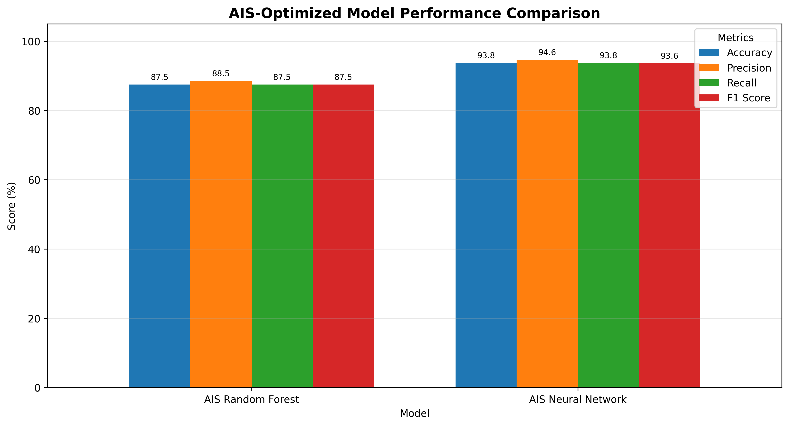

# AI-Based Rainfall Intensity Classification

## Overview

The **AI-Based Rainfall Intensity Classification** project is a machine learning and deep learning system designed to analyze rainfall patterns and classify different geographical locations according to rainfall intensity.

The project processes daily rainfall observations collected across different **districts, talukas, and circles**. Statistical rainfall features are extracted from the daily measurements and used to classify rainfall conditions into three categories:

- **Low Rainfall**
- **Moderate Rainfall**
- **High Rainfall**

The project implements multiple approaches, including **Random Forest**, **Artificial Neural Networks (ANN)**, **Artificial Immune System (AIS)**, and **Particle Swarm Optimization (PSO)**.

AIS and PSO are used as optimization techniques for selecting useful rainfall features before training the classification models.

The optimized models are evaluated using **accuracy, precision, recall, F1-score, and confusion matrices**.

---

# Project Title

**AI-Based Rainfall Intensity Classification Using Machine Learning, Artificial Immune System, and Particle Swarm Optimization**

---

# Objective

The main objectives of this project are:

- Analyze daily rainfall measurements from different geographical regions.
- Clean and preprocess rainfall data.
- Extract meaningful statistical features from daily rainfall records.
- Analyze rainfall patterns across districts, talukas, and circles.
- Calculate total and average rainfall.
- Identify maximum and minimum rainfall.
- Determine the number of rainy and heavy rainfall days.
- Classify rainfall intensity into Low, Moderate, and High categories.
- Train a Random Forest classification model.
- Train an Artificial Neural Network.
- Apply Artificial Immune System optimization for feature selection.
- Apply Particle Swarm Optimization for feature selection.
- Compare the performance of different optimized models.
- Generate rainfall intensity predictions.
- Save trained models and preprocessing information for future use.
- Generate graphical visualizations for model evaluation.

---

# Problem Statement

Rainfall varies considerably between geographical regions and over time. Analyzing large numbers of daily rainfall observations manually can be difficult and time-consuming.

Traditional statistical analysis may identify general rainfall trends, but machine learning techniques can automatically discover patterns within rainfall measurements and classify locations according to their rainfall characteristics.

This project develops an automated rainfall analysis system capable of processing daily rainfall observations and assigning each location to an appropriate rainfall intensity category.

Optimization techniques such as **Artificial Immune System (AIS)** and **Particle Swarm Optimization (PSO)** are additionally used to identify useful rainfall features and reduce unnecessary input variables.

---

# Dataset

The project uses the following dataset:

```text
rainfall_0.csv
```

The dataset contains rainfall measurements for different geographical areas.

Important location-related attributes include:

```text
District
Taluka
Circle
```

The dataset also contains daily rainfall observations such as:

```text
01-Aug
02-Aug
03-Aug
...
31-Aug
01-Sep
02-Sep
...
11-Sep
```

Each row represents rainfall observations associated with a particular geographical location or rainfall monitoring circle.

---

# Dataset Structure

The general dataset structure is:

| Attribute | Description |
|---|---|
| District | Name of the district |
| Taluka | Name of the taluka |
| Circle | Rainfall monitoring circle/location |
| Daily Rainfall Columns | Daily rainfall measurements |
| Total Rainfall | Total rainfall calculated from daily observations |
| Average Rainfall | Mean rainfall |
| Maximum Rainfall | Highest rainfall observation |
| Rainy Days | Number of days with recorded rainfall |
| Rainfall Intensity | Generated target classification |

---

# Rainfall Intensity Classes

The project classifies rainfall patterns into three categories:

| Class | Description |
|---|---|
| Low | Locations with comparatively lower cumulative rainfall |
| Moderate | Locations with medium cumulative rainfall |
| High | Locations with comparatively higher cumulative rainfall |

The classification thresholds are generated from the distribution of total rainfall values.

The **33rd percentile** and **66th percentile** are used to divide the observations into three rainfall intensity groups.

Conceptually:

```text
Total Rainfall <= 33rd percentile
        ↓
Low Rainfall

33rd percentile < Total Rainfall <= 66th percentile
        ↓
Moderate Rainfall

Total Rainfall > 66th percentile
        ↓
High Rainfall
```

This creates approximately balanced rainfall intensity groups for classification.

---

# Data Preprocessing

Before model training, several preprocessing operations are performed.

These include:

1. Loading the rainfall dataset.
2. Cleaning column names.
3. Identifying geographical columns.
4. Detecting rainfall measurement columns.
5. Converting rainfall measurements into numeric format.
6. Replacing invalid values.
7. Handling missing rainfall observations.
8. Removing negative rainfall values.
9. Creating statistical rainfall features.
10. Encoding rainfall intensity classes.
11. Splitting the dataset into training and testing sets.
12. Standardizing features for neural-network training.

Missing rainfall values are converted to zero where appropriate.

Invalid infinite values are replaced before model training.

---

# Feature Engineering

Several statistical features are generated from the original daily rainfall measurements.

## Total Rainfall

The cumulative rainfall for a location is calculated as:

```text
Total Rainfall = Sum of all daily rainfall measurements
```

---

## Average Rainfall

Average rainfall is calculated as:

```text
Average Rainfall = Total Rainfall / Number of rainfall observation days
```

---

## Maximum Rainfall

Represents the maximum daily rainfall recorded for a location.

---

## Minimum Rainfall

Represents the minimum daily rainfall observation.

---

## Rainfall Standard Deviation

Standard deviation measures the variability of rainfall observations.

A higher value indicates greater variation in rainfall.

---

## Rainy Days

The number of days where rainfall is greater than zero.

```text
Rainfall > 0
```

---

## Moderate Rain Days

Days where rainfall reaches or exceeds:

```text
15.6 mm
```

---

## Heavy Rain Days

Days where rainfall reaches or exceeds:

```text
64.5 mm
```

---

## Very Heavy Rain Days

Days where rainfall reaches or exceeds:

```text
115.6 mm
```

---

## Extreme Rain Days

Days where rainfall reaches or exceeds:

```text
204.5 mm
```

---

## Rainfall Range

Rainfall range is calculated as:

```text
Rainfall Range = Maximum Rainfall - Minimum Rainfall
```

---

## Rainfall Coefficient of Variation

The coefficient of variation is calculated using:

```text
Rainfall CV = Rainfall Standard Deviation / Average Rainfall
```

This feature helps represent rainfall variability relative to average rainfall.

---

# Month-Wise Rainfall Features

The project also extracts month-specific rainfall characteristics.

## August Features

```text
August_Total_Rainfall
August_Average_Rainfall
```

These features summarize rainfall observations recorded during August.

## September Features

```text
September_Total_Rainfall
September_Average_Rainfall
```

These features summarize the available rainfall observations from September.

---

# Candidate Features

The complete candidate feature set includes:

```text
Average_Rainfall
Maximum_Rainfall
Minimum_Rainfall
Rainfall_Std
Rainy_Days
Moderate_Rain_Days
Heavy_Rain_Days
Very_Heavy_Rain_Days
Extreme_Rain_Days
Rainfall_Range
Rainfall_CV
August_Total_Rainfall
August_Average_Rainfall
September_Total_Rainfall
September_Average_Rainfall
```

AIS and PSO search for useful subsets of these features.

---

# Machine Learning Models

The project uses two primary predictive models.

## Random Forest Classifier

Random Forest is an ensemble machine learning algorithm that combines multiple decision trees.

It is suitable for rainfall classification because it can:

- Model nonlinear relationships.
- Handle multiple numerical features.
- Capture interactions between rainfall variables.
- Provide feature importance scores.
- Work effectively with relatively small tabular datasets.
- Reduce overfitting compared with individual decision trees.

The project uses a balanced Random Forest classifier to reduce problems caused by class imbalance.

---

# Artificial Neural Network

A feed-forward Artificial Neural Network is also implemented.

The general architecture is:

```text
Input Layer
     ↓
Dense Layer - 64 neurons - ReLU
     ↓
Dropout
     ↓
Dense Layer - 32 neurons - ReLU
     ↓
Dropout
     ↓
Dense Layer - 16 neurons - ReLU
     ↓
Output Layer - Softmax
     ↓
Low / Moderate / High
```

The output layer uses **Softmax activation** for multi-class rainfall classification.

The model is trained using:

```text
Optimizer: Adam
Loss: Categorical Crossentropy
Metric: Accuracy
```

Early stopping is used to reduce unnecessary training and help prevent overfitting.

---

# Artificial Immune System Optimization

Artificial Immune System is a bio-inspired optimization approach based on mechanisms observed in the biological immune system.

This project uses a **Clonal Selection inspired AIS algorithm** for rainfall feature selection.

Each candidate feature subset is represented as an artificial antibody.

For example:

```text
[1, 0, 1, 1, 0, 1, 0, 0, 1, ...]
```

where:

```text
1 = Feature Selected
0 = Feature Not Selected
```

The quality of each antibody is evaluated using model performance.

---

# AIS Optimization Process

The AIS optimization follows the general process:

```text
Generate Initial Antibody Population
              ↓
Evaluate Feature Subsets
              ↓
Calculate Fitness
              ↓
Select Best Antibodies
              ↓
Clone Strong Antibodies
              ↓
Apply Mutation
              ↓
Evaluate New Antibodies
              ↓
Retain Strong Candidates
              ↓
Introduce New Random Antibodies
              ↓
Repeat for Multiple Generations
              ↓
Select Best Feature Subset
```

This process allows the algorithm to explore different combinations of rainfall features.

---

# AIS Fitness Function

The AIS fitness function primarily considers validation accuracy.

A small penalty is also applied for selecting too many features.

Conceptually:

```text
Fitness = Validation Accuracy - Feature Selection Penalty
```

This encourages the optimization algorithm to identify a compact feature subset while maintaining good classification performance.

---

# Advantages of AIS Feature Selection

AIS optimization can provide several advantages:

- Removes unnecessary features.
- Searches multiple feature combinations.
- Reduces feature dimensionality.
- Can improve model efficiency.
- Helps identify informative rainfall variables.
- Uses evolutionary search instead of checking every possible feature combination.

---

# Particle Swarm Optimization

Particle Swarm Optimization is another population-based optimization technique used in this project.

PSO is inspired by collective behaviors such as:

- Bird flocking
- Fish schooling
- Swarm movement

In this project, **Binary Particle Swarm Optimization** is used for feature selection.

Each particle represents a possible subset of rainfall features.

Example:

```text
Particle = [1, 1, 0, 1, 0, 0, 1, ...]
```

where:

```text
1 = Feature Selected
0 = Feature Not Selected
```

---

# PSO Optimization Process

The Binary PSO process can be summarized as:

```text
Initialize Particle Population
            ↓
Evaluate Particle Fitness
            ↓
Update Personal Best
            ↓
Update Global Best
            ↓
Calculate Particle Velocity
            ↓
Apply Sigmoid Transformation
            ↓
Update Binary Feature Selection
            ↓
Repeat for Multiple Iterations
            ↓
Select Global Best Feature Subset
```

Each particle learns from both its own best solution and the best solution found by the entire swarm.

---

# Model Evaluation

The models are evaluated using several classification metrics.

## Accuracy

Accuracy represents the proportion of correctly classified observations.

```text
Accuracy =
Correct Predictions / Total Predictions
```

---

## Precision

Precision measures how many observations predicted as a particular class actually belong to that class.

```text
Precision =
True Positive / (True Positive + False Positive)
```

---

## Recall

Recall measures how many actual observations belonging to a class were correctly identified.

```text
Recall =
True Positive / (True Positive + False Negative)
```

---

## F1-Score

F1-score provides a balance between precision and recall.

```text
F1 =
2 × (Precision × Recall) / (Precision + Recall)
```

---

# Model Comparison Visualization

The following graph compares the performance of the **AIS-optimized Random Forest** and **AIS-optimized Neural Network**.

It includes:

- Accuracy
- Precision
- Recall
- F1-Score



The visualization makes it easier to compare the classification performance of the AIS-optimized models across multiple evaluation metrics.

---

# Confusion Matrix

A confusion matrix is generated to analyze classification performance for each rainfall intensity category.

The matrix compares:

```text
Actual Rainfall Class
        VS
Predicted Rainfall Class
```

The AIS confusion matrix is stored as:

```text
ais_heatmap.png
```

The PSO confusion matrix is stored as:

```text
pso_heatmap.png
```

---

# Feature Importance

Random Forest provides feature importance values that indicate how strongly each selected rainfall variable contributes to classification.

AIS feature importance is stored in:

```text
ais_feature_importance_graph.png
```

PSO feature importance is stored in:

```text
pso_feature_importance_graph.png
```

These visualizations help identify influential rainfall characteristics within the optimized feature subsets.

---

# AIS Optimization Visualization

The progress of AIS optimization is stored as:

```text
ais_feature_selection_graph.png
```

The graph shows how the best fitness value changes over successive AIS generations.

This helps visualize the convergence behavior of the optimization algorithm.

---

# PSO Optimization Visualization

PSO optimization progress is stored as:

```text
pso_feature_selection_graph.png
```

The graph represents the global best fitness discovered by the swarm across successive iterations.

---

# Result CSV

The standard model generates:

```text
result.csv
```

The AIS model generates:

```text
ais_result.csv
```

The PSO model generates:

```text
pso_result.csv
```

The optimized result files contain information such as:

```text
District
Taluka
Circle
Total_Rainfall
Average_Rainfall
Maximum_Rainfall
Rainy_Days
Heavy_Rain_Days
Actual_Intensity
Predicted_Intensity
Prediction_Correct
```

For AIS and PSO, predictions from both the Random Forest and neural network are included.

---

# Prediction CSV

The project also generates predictions for the complete processed dataset.

Standard predictions are stored in:

```text
prediction.csv
```

AIS predictions are stored in:

```text
ais_prediction.csv
```

PSO predictions are stored in:

```text
pso_prediction.csv
```

The optimized prediction files contain fields such as:

```text
District
Taluka
Circle
Total_Rainfall
Average_Rainfall
Maximum_Rainfall
Rainfall_Std
Rainy_Days
Heavy_Rain_Days
Actual_Intensity
Optimized_RF_Prediction
Optimized_NN_Prediction
RF_Confidence
NN_Confidence
```

---

# Saved Models

The project saves trained models so that they can be reused without retraining.

## Standard Models

```text
rainfall_model.h5
rainfall_model.pkl
```

## AIS Models

```text
ais_rainfall_model.h5
ais_rainfall_model.pkl
```

## PSO Models

```text
pso_rainfall_model.h5
pso_rainfall_model.pkl
```

The `.h5` files contain the trained neural-network models.

The `.pkl` files contain the Random Forest model and supporting preprocessing information such as:

- Selected features
- Feature names
- Standard scaler
- Label encoder
- Rainfall columns
- Optimization information
- Classification thresholds

---

# Configuration Files

The project generates YAML configuration files:

```text
rainfall_config.yaml
ais_rainfall_config.yaml
pso_rainfall_config.yaml
```

These files store information about:

- Project configuration
- Dataset characteristics
- Selected features
- Model settings
- Optimization settings
- Performance metrics

---

# Metadata Files

Metadata is stored in JSON format:

```text
rainfall_metadata.json
ais_rainfall_metadata.json
pso_rainfall_metadata.json
```

The metadata includes information such as:

- Dataset information
- Feature names
- Selected features
- Optimization parameters
- Model performance
- Target classes
- Rainfall classification thresholds

---

# Generated Output Files

The project can generate the following structure:

```text
AI-Based Rainfall Intensity Classification/
│
├── rainfall_0.csv
│
├── rainfall_model.h5
├── rainfall_model.pkl
├── rainfall_config.yaml
├── rainfall_metadata.json
│
├── accuracy_graph.png
├── comparison_graph.png
├── heatmap.png
├── result.csv
├── result_graph.png
├── prediction.csv
├── prediction_graph.png
├── feature_importance_graph.png
│
├── ais_rainfall_model.h5
├── ais_rainfall_model.pkl
├── ais_rainfall_config.yaml
├── ais_rainfall_metadata.json
│
├── ais_accuracy_graph.png
├── ais_comparison_graph.png
├── ais_heatmap.png
├── ais_result.csv
├── ais_result_graph.png
├── ais_prediction.csv
├── ais_prediction_graph.png
├── ais_feature_selection_graph.png
├── ais_feature_importance_graph.png
│
├── pso_rainfall_model.h5
├── pso_rainfall_model.pkl
├── pso_rainfall_config.yaml
├── pso_rainfall_metadata.json
│
├── pso_accuracy_graph.png
├── pso_comparison_graph.png
├── pso_heatmap.png
├── pso_result.csv
├── pso_result_graph.png
├── pso_prediction.csv
├── pso_prediction_graph.png
├── pso_feature_selection_graph.png
└── pso_feature_importance_graph.png
```

---

# Project Workflow

The complete project workflow is:

```text
Rainfall Dataset
       ↓
Data Loading
       ↓
Data Cleaning
       ↓
Rainfall Column Detection
       ↓
Feature Engineering
       ↓
Rainfall Intensity Generation
       ↓
Low / Moderate / High Classes
       ↓
Train-Test Split
       ↓
────────────────────────────────────
       ↓              ↓
 Standard Model    Optimization
       ↓              ↓
 Random Forest     AIS / PSO
       ↓              ↓
 Neural Network    Feature Selection
       ↓              ↓
       └──────→ Optimized Features
                       ↓
                Random Forest
                       ↓
                Neural Network
                       ↓
────────────────────────────────────
       ↓
Model Evaluation
       ↓
Accuracy / Precision / Recall / F1
       ↓
Confusion Matrix
       ↓
Result CSV
       ↓
Prediction CSV
       ↓
Graphs and Visualizations
       ↓
Saved Models
```

---

# Technologies Used

The project is developed using:

- **Python**
- **Pandas**
- **NumPy**
- **Scikit-learn**
- **TensorFlow**
- **Keras**
- **Matplotlib**
- **Joblib**
- **PyYAML**
- **JSON**

---

# Installation

Install the required Python libraries using:

```bash
pip install pandas numpy scikit-learn tensorflow matplotlib joblib pyyaml
```

---

# Running the Project

Make sure the dataset exists at:

```text
C:\Users\sagni\Downloads\AI-Based Rainfall Intensity Classification\rainfall_0.csv
```

Then execute the Python scripts or Jupyter Notebook cells.

The program automatically:

```text
Loads Dataset
      ↓
Preprocesses Rainfall Data
      ↓
Creates Features
      ↓
Generates Rainfall Classes
      ↓
Trains Models
      ↓
Runs AIS / PSO Optimization
      ↓
Evaluates Models
      ↓
Creates Predictions
      ↓
Saves CSV Files
      ↓
Saves Graphs
      ↓
Saves Models
      ↓
Saves YAML and JSON Metadata
```

---

# Applications

This rainfall classification system can support exploratory applications such as:

- Rainfall pattern analysis
- Regional rainfall classification
- Agricultural rainfall assessment
- Water-resource analysis
- Environmental data analysis
- Rainfall monitoring studies
- Climate-data research
- Identification of comparatively high-rainfall locations
- Machine-learning-based meteorological research

---

# Advantages

Important advantages of this project include:

- Automated rainfall analysis.
- Multiple machine learning approaches.
- Deep learning implementation.
- Bio-inspired AIS optimization.
- Swarm-based PSO optimization.
- Automated feature engineering.
- Automated feature selection.
- Multiple model evaluation metrics.
- Prediction confidence generation.
- Model persistence using H5 and PKL.
- Easy-to-understand graphical outputs.
- Reusable YAML and JSON configuration files.

---

# Limitations

The current implementation also has several limitations.

- The dataset is relatively small.
- Rainfall intensity labels are derived from the dataset rather than externally supplied meteorological outcome labels.
- Performance can vary depending on the train-test split.
- Neural networks generally benefit from larger datasets.
- Rainfall measurements from a limited period may not represent long-term climate behavior.
- The current classification is intended primarily for rainfall-pattern analysis rather than operational weather forecasting.
- More years of historical rainfall data would improve temporal analysis.
- Additional meteorological variables could improve future predictive models.

---

# Important Methodological Note

The target rainfall classes in this project are generated from **Total Rainfall** using percentile-based thresholds.

Therefore, features derived directly from the same rainfall observations can be strongly related to the generated target.

For this reason, very high classification accuracy should not automatically be interpreted as evidence that the system can forecast future rainfall.

The current project is best described as a **rainfall intensity classification and pattern-analysis system**.

A stronger forecasting version could use rainfall observations from an earlier time period to predict rainfall intensity in a future period.

For example:

```text
August Rainfall Features
          ↓
Machine Learning Model
          ↓
Predict September Rainfall Intensity
```

This would provide a more rigorous separation between predictor variables and future prediction targets.

---

# Future Improvements

Future versions of the project can include:

- Multiple years of historical rainfall records.
- Temperature information.
- Humidity measurements.
- Atmospheric pressure.
- Wind speed and direction.
- Satellite weather data.
- Seasonal rainfall information.
- Geographic coordinates.
- Soil moisture data.
- Time-series forecasting.
- LSTM networks.
- GRU networks.
- XGBoost.
- LightGBM.
- Ensemble learning.
- Hyperparameter optimization.
- Cross-validation.
- Explainable AI using SHAP.
- Rainfall anomaly detection.
- Extreme rainfall event prediction.

A future model could also predict actual rainfall values rather than only rainfall categories.

---

# Conclusion

The **AI-Based Rainfall Intensity Classification** project demonstrates how machine learning, deep learning, and bio-inspired optimization techniques can be applied to rainfall datasets.

Daily rainfall observations are transformed into statistical features describing rainfall amount, frequency, variability, and intensity. These features are then used to classify geographical locations into **Low, Moderate, and High rainfall intensity categories**.

Random Forest and Artificial Neural Network models provide the primary classification mechanisms, while **Artificial Immune System (AIS)** and **Particle Swarm Optimization (PSO)** are used to search for informative feature subsets.

The project also generates reusable trained models, CSV prediction results, model metadata, performance metrics, confusion matrices, optimization graphs, and comparison visualizations.

Overall, the system provides a structured framework for **rainfall pattern classification, optimized feature selection, and machine-learning-based rainfall data analysis**.

---

# Main Visualization


---

# Author

**AI-Based Rainfall Intensity Classification Project**

Machine Learning | Deep Learning | Artificial Immune System | Particle Swarm Optimization | Rainfall Data Analysis
